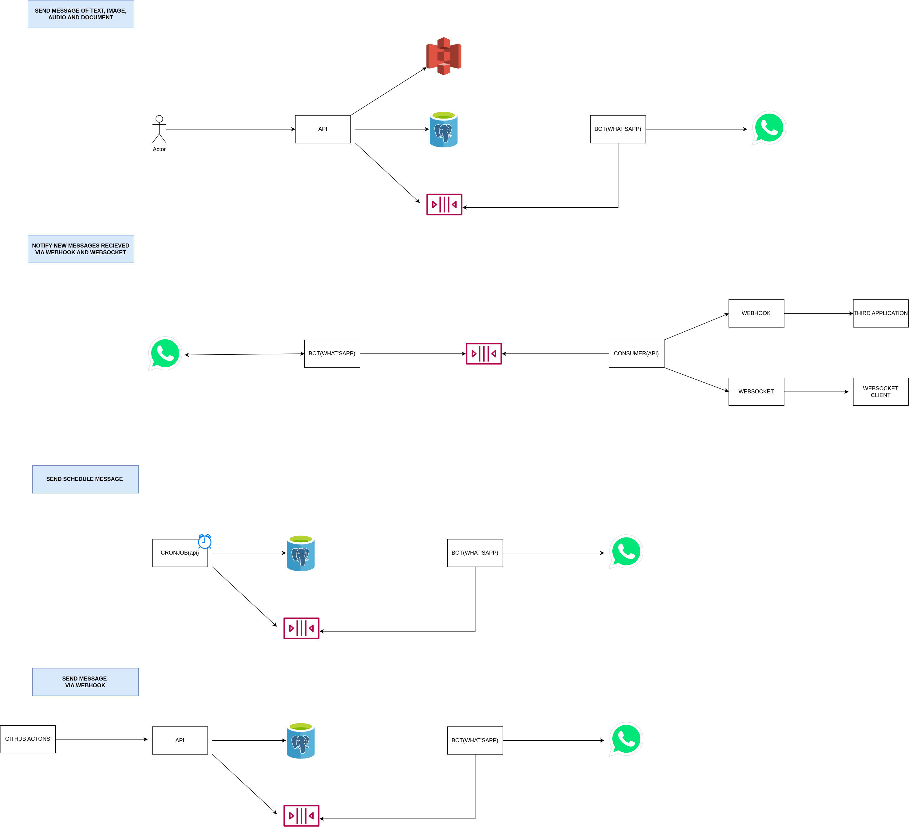
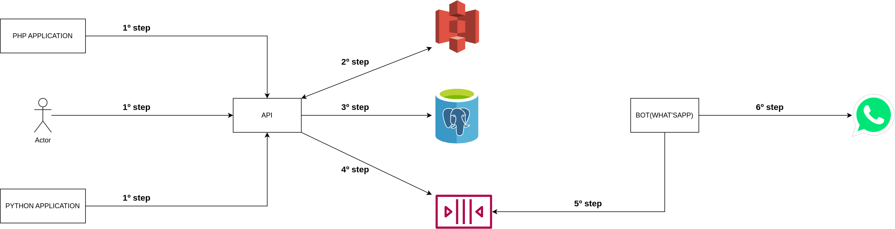
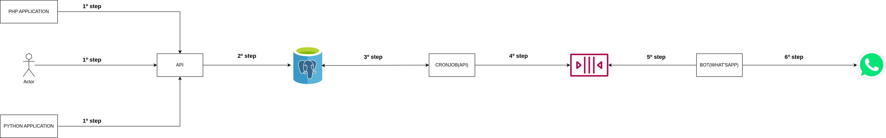
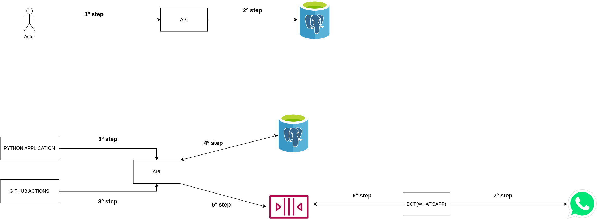
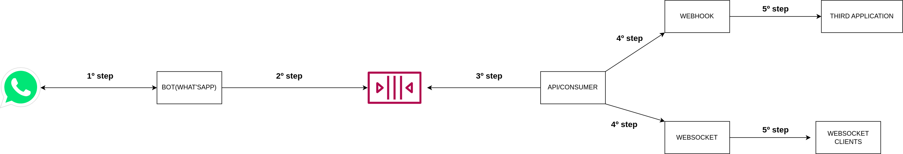
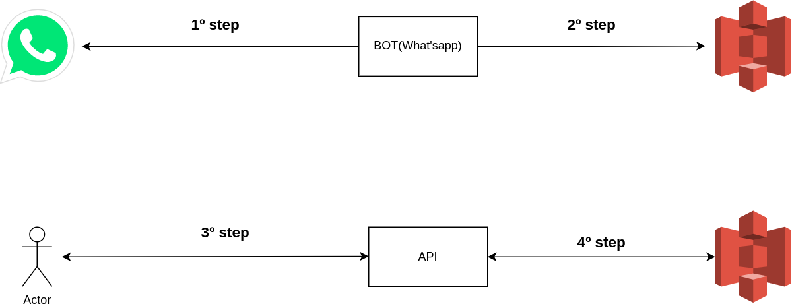
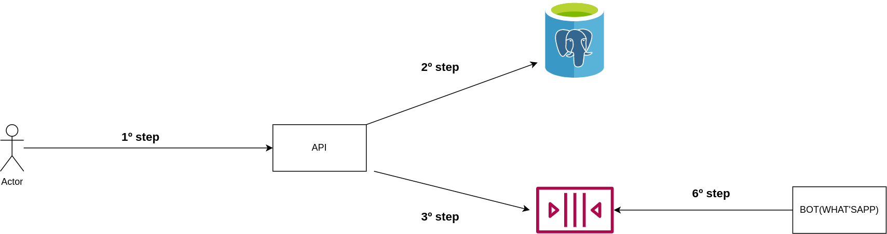

# Overview about the project architecture

# What is technologies applied in this project

- Api
  - Node.js
  - Typescript
  - Nest.js
  - Postgresql(Database)
  - Storage(AWS S3)
  - Rabbitmq(Queue)
  - Socket.io(websocket)
  - Jest(for unit tests implemented api)

- Bot
  - Node.js
  - Typescript
  - Storage(AWS S3)
  - Rabbitmq(Queue)
- Others
  - Docker
  - Docker compose
  - Pm2
  - Github actions(CI pipeline)

# Why I choose this technologies

- Node.js
  - Because is main technology today, so many experiencies.
  - Already has good libs to handle whatsapp in Node.js like **venom-bot** used in **bot**
- Typescript
  - Give for javascript a lot important things when you work OOP(Object-oriented programming)
  - Can apply concept like *Dependency inversion principle* the *solid* that way i can replace one part like storage more easily and prevent generate a lot problems in project. For example: current storage is S3, but for you is more good use Google drive with storage.
- Nest.js
  - To learn more about this framework, because i see many companies currently using this technology.
  - Give for developer many ready-made thinks. For example: send mail has module you install and can start to use.
  - The nest.js has structure defined, different the express.js each project has one structure because give a lot flexibility for developer or developer team. One structure defined help to keep the project more organizaded.
- Postgresql
  - Open-source project, so you don't have vendor lock with cloud provider.
  - Exist service like RDS or Aurora can configure the postgresql database easily for you.
  - The project all data has fixed structure, so no necessary any NoSql database.
  - I have working with Postgresql a long time.
- S3
  - I know how to work with this solution
  - No necessary take care if disk full 
  - Is safe
  - Is simple for use
  - No have problem case scale **api** horizontally.
- Rabbitmq
  - Open-source project, don't have vendor lock like SQS.
  - The project i need work with pub/sub pattern and **rabbitmq** allow work with this pattern easily.
  - I know how to work a little bit this technology.
  - I need one solution allow send message more big for queue, because how What'sapp allow send message until 16MB i need one solution allow this and **Rabbmitmq** allow me. Reference links: https://faq.whatsapp.com/1119635945362627?cms_id=1119635945362627&draft=false and https://www.cloudamqp.com/blog/what-is-the-message-size-limit-in-rabbitmq.html#:~:text=While%20the%20theoretical%20message%20size,max%20size%20limit%20in%203.8. 
  - To use message queue allow scale easily because i can increase more consumer to process big demand.
  - Message queue prevent lost message when consumer or bot instance no running, because message kept in message queue until someone consume.
- Socket.io
  - Lib allow easily implement websocket
- Jest
  - Test lib comes together the Nest.js
- Docker and docker-compose
  - Allow easily create development environemt
- Github actions
  - I know to work because I hove before experiencies.
  - Free to public repository.
  - Used per a lot people.
- PM2
  - Managament process node.js applications that very popular.
  - Restart process if crash.
  - Can create multiple processes easily using module **cluster**.

The image above is overview the project architecture more below i explain each piece the architecture in more details.

## Architecture the feature send message to the What'sapp

Explain each step:
- 1º step: 1 person, php application, python application and any application make request for **api**.
- 2º step: **api** receive request if you try send image, audio or document message i will upload the content the base64URL for **S3** storage, case you try send text message this step is unnecessary.
- 3º step: save message data in **Postgresql**.
- 4º step: send message to **Rabbitmq** queue.
- 5º step: bot(instance the what'sapp) consume message in **Rabbitmq** queue.
- 6º step: bot got message and send for What'sapp using lib **venom-bot**.
  
## Architecture the feature send schedule message to the What'sapp

Explain each step:
- 1º step: 1 person, php application, python application and any application make request for **api**.
- 2º step: save schedule message in **Postgresql**
- 3º step: the **api** has scheduler execute each 5 minutes. The scheduler execute query get schedule message has schedule date less than current date.
- 4º step: After got schedule messages to for **Rabbimq** queue
- 5º step: bot(instance the what'sapp) consume message in **Rabbitmq** queue.
- 6º step: bot got message and send for What'sapp using lib **venom-bot**.

  
## Architecture the feature send text message via webhook

> First i believe is interesting explain what i created this feature. A lot situation you need using webhook like: 
>  - Integration 2 apps and this app using webhook to send event for another
> - You have CI/CD pipeline and you want notify via Whatsapp if some error occurred
> - You need send text message through another application using webhook simplify all process.

Explain each step:
- 1º step: 1 person make request to create webhook url in **api**.
- 2º step: save data the webhook in **Postgresql**
- 3º step: 1 person, php application, python application and any application make request for **api** url webhook url.
- 4º step: validate if webhook if valid to execute request and save data message in **Postgresql**
- 5º step: send message to **Rabbitmq** queue.
- 6º step: bot get text message.
- 7º step: send for What'sapp using lib **venom-bot**.

  
## Architecture the feature notify new message recieved in instance the what'sapp.

Explain each step:
- 1º step: instance what'sapp listen new message received what'sapp number.
- 2º step: send message recieved to **Rabbitmq** queue
- 3º step: consumer get message to notify via webhook and via websocket. Warning: exist 2 consumer, 1 consumer get the message and notify via webhook and 1 consumer get the message and notify via websocket. I can made this easily because **Rabbitmq** has exchange type *fanout* that implement pub/sub pattern, so in this case i send message using exchange type *fanout* all queues subscribed in this exchange receive same message.
- 4º step: send message via webhook and send message via websocket.
- 5º step: the application receive send via webhook execute any logic and websocket clients receive the messae because the clients are connected websocket server.

## Architecture the feature get whatsapp qrcode

Explain each step:
- 1º step: bot instance after started using get qrcode generated by web whatsapp.
- 2º step: bot instance got qrcode and after save in storage, in this case S3 storage, but you can replace this for google drive ou another storage solultion you think is more suitable for you.
- 3º step: 1 people or application make request for **api** é api return qrcode.

## Architecture the feature logout the whatsapp instance

Explain each step:
- 1º step: 1 person ou third application send request for **api**.
- 2º step: check if instance exist and check if instance online for make logout.
- 3º step: Send message for **Rabbitmq** queue. In this case for each instance i will create queue named **logout_instance_instance_id_here**.
- 4º step: bot instance get the message and logout whatsapp instance. 

