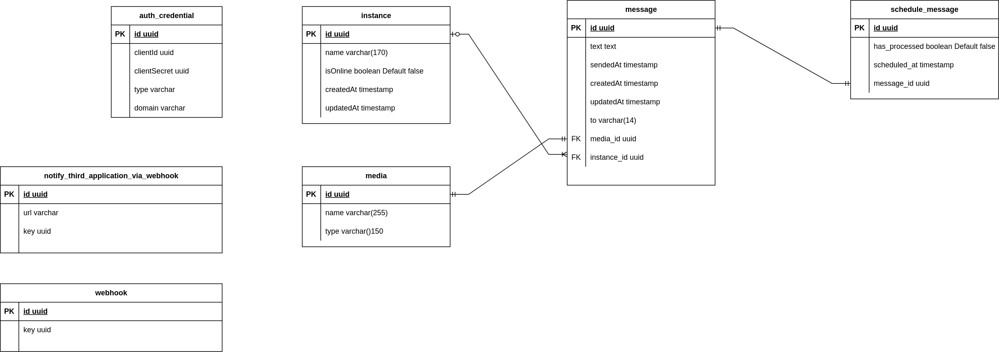

# WARNING

I DON'T RECOMMEND USE THIS PROJECT CASE YOU USE WANT SEND MESSAGE TO WHATSAPP FOR YOUR APP, APPLICATION, WEBSITE OR PRODUCT.

I CREATED THIS PROJECT ONLY TO IMPROVE MY KNOWEDLEGE ABOUT TECHNOLOGIES USED IN THIS PROJECT AND NOTHING MORE.

# About

I created this project only improve my knowledge about Nest.js. But I was want to create one thing different that challenge me, so the result is the api allow send message to numbers in what'sapp contact list and more another features i describe below.

# Features
- Send text message.
- Send audio message.
- Send image message.
- Send document message.
- Send text message to specific instance.
- Send audo message to specific instance.
- Send image message to specific instance.
- Send document message to specific instance.
- Schedule message to send specific date.
- Send text message in batch. WARNING: you can send 20 messages.
- Get new message received what'sapp notify another applications via webhook or websocket.
- Send text message via webhook. WARNING: this feature is ease way to send text message.
- List instances(bot)
- Get instance(bot) by id
- Get qrcode the instance(bot)
- Logout instance(bot) by id

# Technologies

- Api
  - Node.js
  - Typescript
  - Nest.js
  - Postgresql(Database)
  - Storage(AWS S3)
  - Rabbitmq(Queue)
  - Socket.io(websocket)
  - Jest(for unit tests implemented api)

- Bot
  - Node.js
  - Typescript
  - Storage(AWS S3)
  - Rabbitmq(Queue)
- Others
  - Docker
  - Docker compose
  - Pm2
  - Github actions(CI pipeline)

# Database diagram

# You want learn more about the project architecture 

Link: [Learm more about architecture here](./ARCHITECTURE.md)

# Instructions to run locally api with docker
- Clone project
- Access directory **api**
- Execute command **npm i** to install all modules necessaries to api
- Create **.env** file based **.env.example** file
- Execute command **cd .. && docker-compose up -d && docker stop zapeasy_api zapeasy_bot** to running containers: postgresql and pgadmin.
- Execute command **npm run build** generate build the api
- Execute command **node dist/main-command.js auth:create -t type_credential_here** have three types: **api** to use api, **websocket** use the credentials in client websocket and **client_websocket** use the credentials in browser client websocket 
- Setup rabbitmq execute command: **npm run build && node dist/setup-rabbitmq.js**
- Execute command **npm run start:dev**
- Access address http://localhost:3000/docs to load swagger documentation for you.

# Instructions to run locally api
- Clone project
- Access directory **api**
- Execute command **npm i** to install all modules necessaries to api
- Create **.env** file based **.env.example** file
- Execute command **cd .. && docker-compose up -d** to running containers: postgresql, pgadmin, api and bot.
- To generate credentials to access api execute command: 
  - **docker exec -it zapeasy_api /bin/sh**
  - **npm run build**
  - **node dist/main-command.js auth:create -t type_credential_here** have three types: **api** to use api, **websocket** use the credentials in client websocket and **client_websocket** use the credentials in browser client websocket 
- Setup rabbitmq execute command:
  - **docker exec -it zapeasy_api /bin/sh**
  - **npm run build**
  - **node dist/setup-rabbitmq.js**
- Access address http://localhost:3000/docs to load swagger documentation for you.

# Instructions to run locally instance(bot) what'sapp without docker
- Execute all instructions the api without docker
- Clone project
- Access directory **bot**
- Execute command **npm i** to install all modules necessaries to bot
- Create **.env** file based **.env.example** file
- Execute command: **cd api ** npm run build && node dist/main-command.js instance:create** get instance id showed on output.
- Execute command **cd bot && npm run start:dev instance_id_generated_step_above_here**

# Instructions to run locally instance(bot) what'sapp
- Execute all instructions the api
- Clone project
- Access directory **bot**
- Execute command **npm i** to install all modules necessaries to bot
- Create **.env** file based **.env.example** file
- Execute command:
  - **docker exec -it zapeasy_api /bin/sh**
  - **npm run build**
  - **node dist/main-command.js instance:create** get instance id showed on output.
- Access docker-compose.yml change line 19 to ***node ./build/index.js instance_id_generated_step_above_here**
- Execute command **cd .. && docker-compose up -d** to running containers: postgresql, pgadmin, api and bot.

